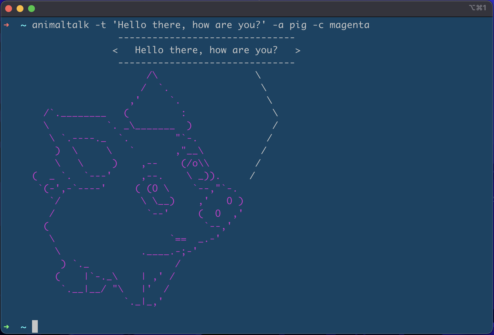
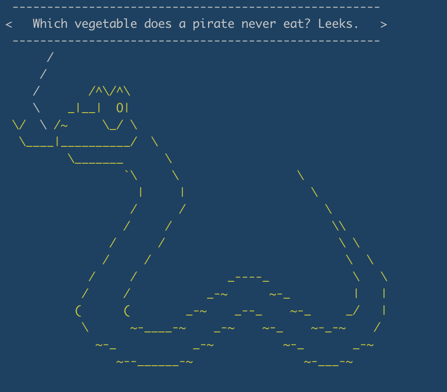

# animal-talk

Animal Talk is a global CLI tool where the animals can talk and they will say what you want them to say.

## Installation

Simply install the tool through npm or yarn

#### NPM

```bash
$ npm install -g animal-talk
```

#### Yarn

```bash
$ yarn global add animal-talk
```

## Usage

When using the `animaltalk` command, there are some options that can be specefied.

#### Options

| Option             | input                                        | required |
| ------------------ | -------------------------------------------- | -------- |
| `-t` \| `--text`   | Text to pass through to the animal           | no       |
| `-a` \| `--animal` | Chooses one of the below [Animals](#Animals) | no       |
| `-c` \| `--color`  | Chooses one of the below [Colors](#Colors)   | no       |
| `-j` \| `--joke`   | When selected, the animal will tell a joke   | no       |

#### Animals

- [`aardvark`](docs/aardvark.md)
- [`antelope`](docs/antelope.md)
- [`bat`](docs/bat.md)
- [`bird`](docs/bird.md)
- [`bulldog`](docs/bulldog.md)
- [`bunny`](docs/bunny.md)
- [`cat`](docs/cat.md)
- [`cow`](docs/cow.md)
- [`crocodile`](docs/crocodile.md)
- [`deer`](docs/deer.md)
- [`donkey`](docs/donkey.md)
- [`elephant`](docs/elephant.md)
- [`frog`](docs/frog.md)
- [`happyDog`](docs/happy-dog.md)
- [`hangingMonkey`](docs/hanging-monkey.md)
- [`horse`](docs/horse.md)
- [`lamb`](docs/lamb.md)
- [`lion`](docs/lion.md)
- [`moose`](docs/moose.md)
- [`parrot`](docs/parrot.md)
- [`pig`](docs/pig.md)
- [`possum`](docs/possum.md)
- [`prayingMonkey`](docs/praying-monkey.md)
- [`snail`](docs/snail.md)
- [`snake`](docs/snake.md)
- [`teddyBear`](docs/teddy-bear.md)
- [`turtle`](docs/turtle.md)
- [`worm`](docs/worm.md)
- `random` (any of the above)

#### Colors

- `black`
- `blue`
- `cyan`
- `gray`
- `green`
- `grey`
- `magenta`
- `random`
- `red`
- `white`
- `yellow`

#### Examples

```bash
$ animaltalk -t 'Hello there, how are you?' -a pig -c magenta
```

```

                         /\                  ---------------------------------
                        /  `.               <   Hello there, how are you?   >
                      ,'     `.              ---------------------------------
       /`.________   (         :                /
       \          `. _\_______  )              /
        \ `.----._  `.        "`-.            /
         )  \     \   `       ,"__\          /
         \   \     )    ,--    (/o\\        /
     (  _ `.  `---'     ,--.    \ _)).     /
      `(-',-`----'     ( (O \    `--,"`-.
        `/              \ \__)    ,'   O )
        /                `--'     (  O  ,'
       (                           `--,'
        \                    `==  _.-'
         \              .____.-;-'
          ) `._               /
         (    |`-._\    | ,' /
          `.__|__/ "\   |'  /
                     `._|_,'
```

The output will be in color as the image below illustrates


---

```bash
$ animaltalk -j -a snake -c yellow
```

```
 -----------------------------------------------------
<   Which vegetable does a pirate never eat? Leeks.   >
 -----------------------------------------------------
      /
     /
    /       /^\/^\
    \    _|__|  O|
 \/  \ /~     \_/ \
  \____|__________/  \
         \_______      \
                 `\     \                 \
                   |     |                  \
                  /      /                    \
                 /     /                       \\
               /      /                         \ \
              /     /                            \  \
            /     /             _----_            \   \
           /     /           _-~      ~-_         |   |
          (      (        _-~    _--_    ~-_     _/   |
           \      ~-____-~    _-~    ~-_    ~-_-~    /
             ~-_           _-~          ~-_       _-~
                ~--______-~                ~-___-~

```

The output will be in color as the image below illustrates

