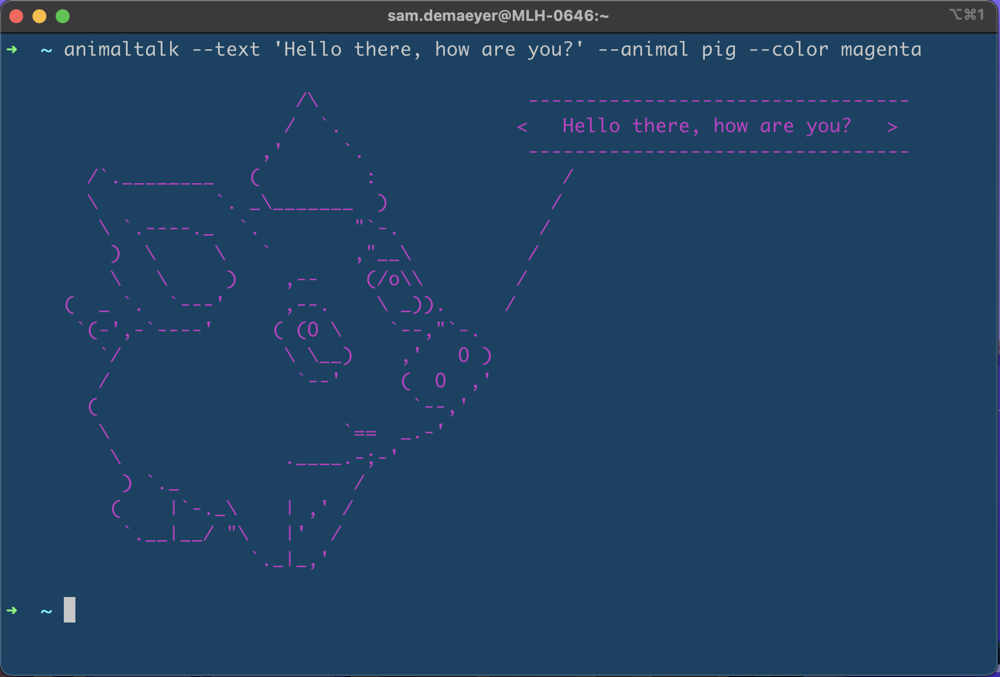

# animal-talk

Animal Talk is a global CLI tool where the animals can talk and they will say what you want them to say.

## Installation

Simply install the tool through npm or yarn

#### NPM

```bash
$ npm install -g animal-talk
```

#### Yarn

```bash
$ yarn global add animal-talk
```

## Usage

When using the `animaltalk` command, there are some options that can be specefied.

#### Options

| Option             | input                                        | required |
| ------------------ | -------------------------------------------- | -------- |
| `-t` \| `--text`   | Text to pass through to the animal           | yes      |
| `-a` \| `--animal` | Chooses one of the below [Animals](#Animals) | no       |
| `-c` \| `--color`  | Chooses one of the below [Colors](#Colors)   | no       |

#### Animals

- `aardvark`
- `antelope`
- `bat`
- `bulldog`
- `bunny`
- `cat`
- `cow`
- `crocodile`
- `deer`
- `donkey`
- `elephant`
- `frog`
- `happyDog`
- `hangingMonkey`
- `horse`
- `lamb`
- `lion`
- `moose`
- `parrot`
- `pig`
- `possum`
- `prayingMonkey`
- `random`
- `snail`
- `snake`
- `teddyBear`
- `turtle`
- `worm`

#### Colors

- `black`
- `blue`
- `cyan`
- `gray`
- `green`
- `grey`
- `magenta`
- `random`
- `red`
- `white`
- `yellow`

#### Example

```bash
$ animaltalk -t 'Hello there, how are you?' -a pig -c magenta
```

```

                         /\                  ---------------------------------
                        /  `.               <   Hello there, how are you?   >
                      ,'     `.              ---------------------------------
       /`.________   (         :                /
       \          `. _\_______  )              /
        \ `.----._  `.        "`-.            /
         )  \     \   `       ,"__\          /
         \   \     )    ,--    (/o\\        /
     (  _ `.  `---'     ,--.    \ _)).     /
      `(-',-`----'     ( (O \    `--,"`-.
        `/              \ \__)    ,'   O )
        /                `--'     (  O  ,'
       (                           `--,'
        \                    `==  _.-'
         \              .____.-;-'
          ) `._               /
         (    |`-._\    | ,' /
          `.__|__/ "\   |'  /
                     `._|_,'
```

The output will be in color as the image below illustrates

